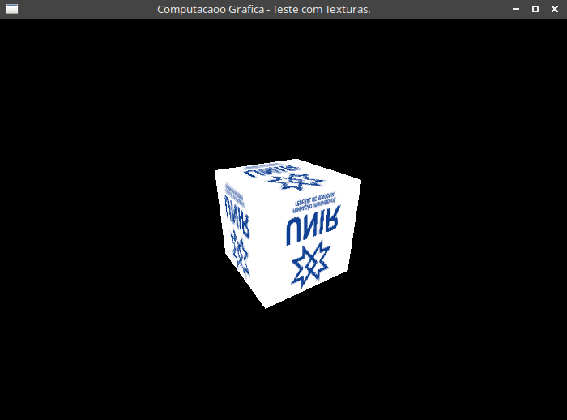

# clion-opengl-template

[en-US] --------------------

CLion starting point (boilerplate) for creating modern OpenGL applications in C in Linux.

The current scene contains a 3D spinning cube whith a texture (only works with .tga image). You can spin the object by left-clicking and dragging on the window.

Cmake -> If you have a better solution to make the texture works in /src/texture directory using cmakelist.txt, you are welcome to pull request.

[pt-BR] --------------------

Um template base para começar projetos com OpenGL no IDE Clion, usando a linguagem C no linux.

A cena do programa atual contem um cubo 3D que gira em todas as direções, com uma textura aplicada (apenas funciona com imagens .tga). 

Voce pode girar o cubo segurando o botão esquerdo do mouse e arrastando dentro da janela.

Cmake -> Se voce tiver uma solução melhor para fazer a textura funcionar no diretório /src/texture usando o cmakelist.txt, fique a vontade para dar pull request.


Installation will be in Portuguese-BR language.

## Instalação

Instale todos os pacotes necessários para o OpenGL funcionar, por exemplo:

```bash
sudo apt-get install libglew-dev
```

## Declaração 

```c
#include <GL/glew.h>
#include "tgaload.h" //encontra em: /include

```
## Screenshots




## Contributing
Pull requests are welcome.


## License
You are free to do whatever you want with this project.

Special Thanks to Prof. Dr. Carolina Yukari Veludo Watanabe for teaching Computer Graphics.


Computer Graphics - UNIR - 2021 class
